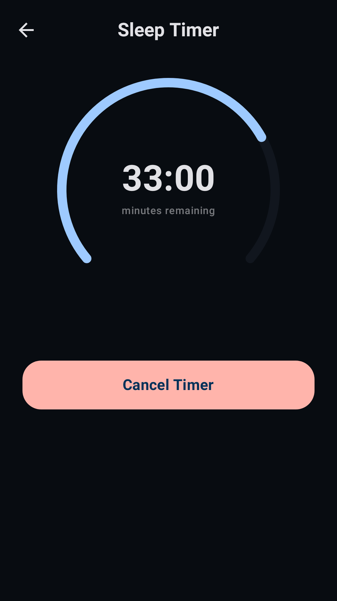
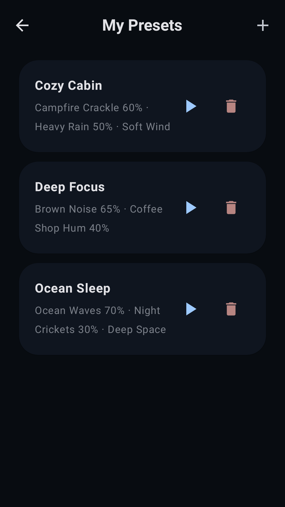
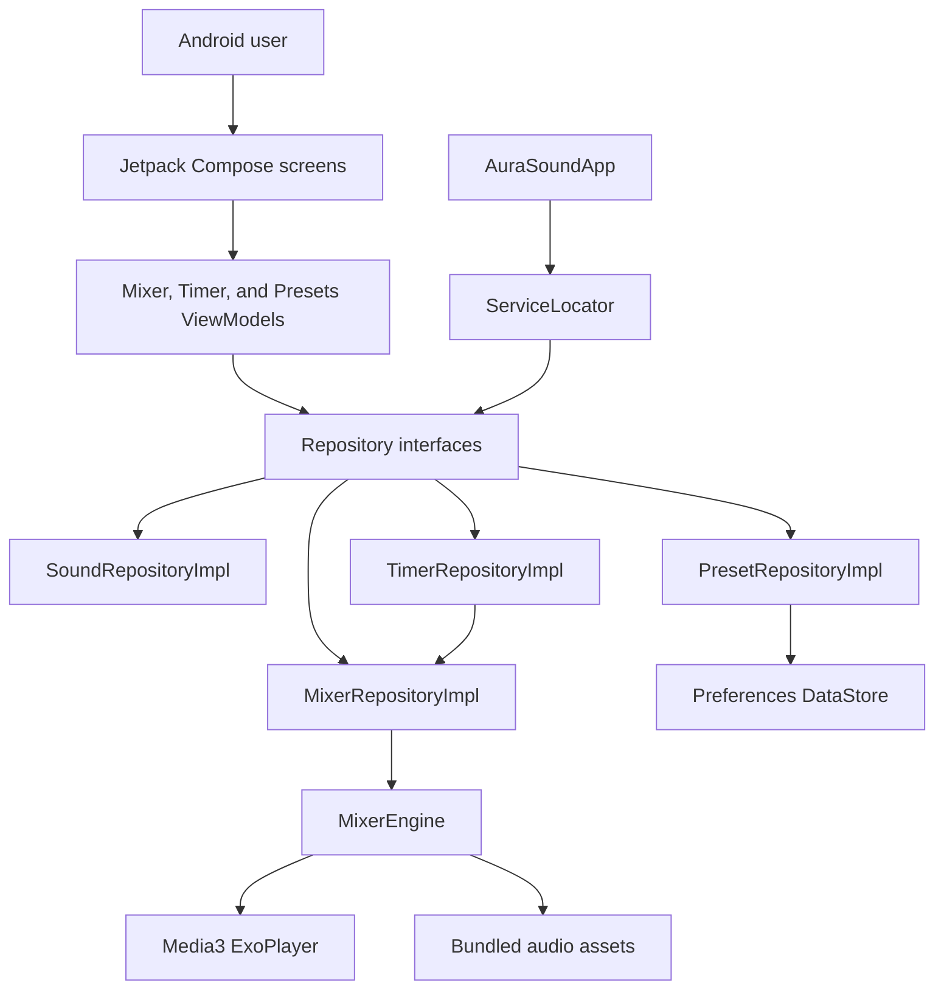

# AuraSound

[](app/build.gradle.kts)
[](app/src/main/AndroidManifest.xml)
[](gradle/libs.versions.toml)
[](#license)
[](https://github.com/michaelsam94/AuraSound/commits/main)
[](https://github.com/michaelsam94/AuraSound/issues)

AuraSound is an offline Android ambient sound mixer for focus, relaxation, meditation, and sleep.
It lets users layer local sound loops, tune each channel, save favorite mixes, and start a sleep
timer without signing in or streaming audio.

## Project Overview

AuraSound turns a phone or tablet into a calm, private soundscape studio. It is designed for people
who want background audio for deep work, studying, meditation, noise masking, or winding down at
night. There is no hosted demo because this is a native Android app; Google Play listing assets are
kept in [`play-store/`](play-store/).

<table>
  <tr>
    <td></td>
    <td></td>
    <td></td>
  </tr>
</table>

## Key Features

- 🎚️ Mix up to four sounds at once with individual volume controls for every channel.
- 🌧️ Choose from 18 bundled offline tracks across Focus, Nature, Ambient, and Sleep categories.
- 💾 Save named presets locally and reload favorite combinations from on-device storage.
- ⏲️ Start a sleep timer with configurable duration and smooth fade-out behavior.
- 📱 Use a phone navigation flow or an adaptive tablet split-pane interface.
- 🔁 Loop local Ogg audio assets through AndroidX Media3 ExoPlayer.
- 🛍️ Generate Play Store screenshots, feature graphics, and app icons from Roborazzi tests.

## Architecture Overview



### Components And Layers

AuraSound uses a compact MVVM structure. Compose screens in `feature/` render state from
ViewModels, ViewModels depend on repository interfaces in `core/data/repository/`, and concrete
implementations in `data/` handle playback, sound catalog access, presets, and timers.

`ServiceLocator` wires application-level dependencies when `AuraSoundApp` starts. `MixerEngine`
owns the Media3 ExoPlayer instances for active channels. Presets are serialized with Moshi and
stored locally with Preferences DataStore.

### Request And Data Flow

A mixer action starts in `MixerScreen`, updates `MixerViewModel`, and calls `MixerRepository`.
The repository updates Kotlin `StateFlow` values for UI state and forwards playback commands to
`MixerEngine`. Timer and preset flows reuse the same repository layer so playback state stays
centralized.

### Design Patterns

- MVVM with Compose state collected from Kotlin `StateFlow`.
- Repository interfaces separating UI logic from data and playback details.
- Service locator dependency wiring without a full DI framework.
- Local-first persistence for presets and bundled asset playback.

## Tech Stack & Libraries

| Layer | Technology | Version | Purpose |
| --- | --- | --- | --- |
| Build system | Gradle Wrapper | 9.5.1 | Reproducible command-line builds |
| Android plugin | Android Gradle Plugin | 9.1.1 | Android application packaging |
| Language | Kotlin | 2.2.10 | App implementation and Compose compiler plugin |
| Platform SDK | Android SDK | compile 36.1, min 24, target 36 | Android runtime compatibility |
| UI | Jetpack Compose BOM | 2024.09.00 | Declarative UI toolkit |
| UI components | Material 3 | BOM-managed | Theme, navigation controls, and surfaces |
| Navigation | Navigation Compose | 2.8.9 | Phone screen navigation |
| Audio | AndroidX Media3 | 1.5.0 | Local looping playback |
| Persistence | DataStore Preferences | 1.1.7 | Saved preset storage |
| Persistence | Room | 2.7.0 | Included in dependencies; not currently used by app flows |
| Serialization | Moshi | 1.15.2 | Preset JSON serialization |
| Async | Kotlin Coroutines | 1.10.2 | Flows, timers, and background work |
| Testing | JUnit | 4.13.2 | JVM unit tests |
| Testing | Robolectric | 4.16.1 | Android JVM tests |
| Screenshots | Roborazzi | 1.59.0 | Store asset generation |
| Secrets | Maps Secrets Gradle Plugin | 2.0.1 | Optional `.env` loading for Gradle |

## Prerequisites

- macOS, Linux, or Windows with Android Studio.
- JDK 17. The current `gradle.properties` pins a Homebrew JDK 17 path; update it if your machine
  uses a different JDK location.
- Android SDK API 36 / 36.1.
- Android emulator or physical device running Android 7.0 or newer.
- Python 3 and `ffmpeg` only when refreshing Freesound-based assets with `scripts/fetch_sounds.py`.

| Variable | Required | Default | Description |
| --- | --- | --- | --- |
| `GEMINI_API_KEY` | No | Value from `.env.example` | Legacy AI Studio placeholder loaded by the secrets plugin. |
| `FREESOUND_TOKEN` | Only for asset refresh | Not configured | API token used by `scripts/fetch_sounds.py`. |
| `KEYSTORE_PATH` | Release fallback only | `${rootDir}/my-upload-key.jks` | Release keystore path when `key.properties` is absent. |
| `STORE_PASSWORD` | Release fallback only | Not configured | Release keystore password. |
| `KEY_PASSWORD` | Release fallback only | Not configured | Release key password. |

## Installation & Setup

1. Clone the repository.

```bash
git clone https://github.com/michaelsam94/AuraSound.git
cd AuraSound
```

2. Check that JDK 17 is available.

```bash
/usr/libexec/java_home -V
```

3. If needed, edit `gradle.properties` so `org.gradle.java.home` points to your local JDK 17.

4. Optional: copy the environment example for local Gradle secret loading.

```bash
cp .env.example .env
```

5. Build the debug APK.

```bash
./gradlew :app:assembleDebug
```

6. Install the app on a connected device or emulator.

```bash
./gradlew :app:installDebug
```

Database setup is not applicable. Presets are created automatically in local DataStore storage.

## Configuration

| File | Purpose | Restart required |
| --- | --- | --- |
| `app/build.gradle.kts` | App id, SDKs, signing, dependencies, test tasks, asset generation | Rebuild |
| `gradle/libs.versions.toml` | Central dependency and plugin versions | Gradle sync |
| `gradle.properties` | JVM memory, JDK path, Gradle cache, Kotlin execution strategy | Gradle daemon restart may be needed |
| `.env` | Optional local values read by the secrets plugin | Rebuild |
| `app/src/main/assets/sounds/` | Bundled sound loops grouped by category | Rebuild |
| `app/src/main/res/values/strings.xml` | App name and text resources | Rebuild |

Release signing uses `key.properties` when present. If that file is missing, the release build
falls back to `KEYSTORE_PATH`, `STORE_PASSWORD`, and `KEY_PASSWORD`.

## Usage / Quick Start

### Build And Run The App

```bash
./gradlew :app:assembleDebug
./gradlew :app:installDebug
```

Open AuraSound, add tracks from the category tabs, adjust channel volumes, and press play to start
the mix.

### Generate Store Assets

```bash
./gradlew generatePlayStoreAssets
```

The task records Roborazzi output into `play-store/`, including phone screenshots, tablet
screenshots, a feature graphic, and a 512 px icon.

### Refresh Audio Assets

```bash
export FREESOUND_TOKEN="your-token"
python3 scripts/fetch_sounds.py
```

This refreshes CC0/public-domain nature, ambient, and sleep tracks, normalizes them with `ffmpeg`,
and updates `app/src/main/assets/sounds/CREDITS.txt`. The focus noise tracks are generated by the
Gradle `generateAmbientSounds` task.

## API Reference

Not applicable. AuraSound is a local Android app and does not expose an HTTP API, CLI API, or
public SDK. Retrofit and OkHttp are listed in the Gradle catalog, but the current source tree does
not define network clients or endpoints.

## Project Structure

```text
.
├── app/
│   ├── build.gradle.kts                  # Android app module configuration
│   └── src/
│       ├── main/
│       │   ├── AndroidManifest.xml        # Activity and media playback service declarations
│       │   ├── assets/sounds/             # Offline Ogg sound loops and credits
│       │   ├── java/com/michael/aurasound/
│       │   │   ├── core/                  # Models, repository interfaces, shared helpers
│       │   │   ├── data/                  # Audio, preset, sound, and timer implementations
│       │   │   ├── feature/               # Mixer, timer, and presets UI/ViewModels
│       │   │   └── ui/theme/              # Compose theme definitions
│       │   └── res/                       # Icons, strings, themes, backup rules
│       ├── test/                          # JVM, Robolectric, and Roborazzi tests
│       └── androidTest/                   # Instrumented Android tests
├── gradle/
│   ├── libs.versions.toml                 # Version catalog
│   └── wrapper/                           # Gradle wrapper configuration
├── play-store/                            # Generated listing graphics and copy
├── scripts/                               # Audio and icon generation helpers
├── build.gradle.kts                       # Top-level Gradle plugin declarations
├── gradle.properties                      # Build JVM and Gradle settings
└── settings.gradle.kts                    # Gradle project/module settings
```

## Testing

Run local JVM, Robolectric, and non-screenshot tests:

```bash
./gradlew :app:testDebugUnitTest
```

Run instrumented tests on a connected Android device or emulator:

```bash
./gradlew :app:connectedDebugAndroidTest
```

Record Roborazzi screenshots directly:

```bash
./gradlew :app:recordRoborazziDebug
```

Generate the Play Store screenshot suite:

```bash
./gradlew generatePlayStoreAssets
```

Unit and Robolectric tests live in `app/src/test/java/`. Instrumented tests live in
`app/src/androidTest/java/`. Screenshot tests are categorized with
`com.michael.aurasound.playstore.PlayStoreScreenshotTests` and are excluded from ordinary
`testDebugUnitTest` runs. Coverage reporting is not configured.

## Deployment

### Debug Build

```bash
./gradlew :app:assembleDebug
```

Debug builds use the local debug signing configuration.

### Release APK

```bash
./gradlew :app:assembleRelease
```

### Release App Bundle

```bash
./gradlew :app:bundleRelease
```

Docker and Docker Compose are not applicable because this repository ships a native Android app,
not a server process. Health checks are not applicable; validate release candidates by installing
the build on a test device and checking audio playback, preset persistence, timer fade-out, and
generated store assets.

## Contributing

1. Fork the repository and create a focused branch such as `feature/preset-export` or
   `fix/timer-fadeout`.
2. Use Conventional Commits, for example `feat: add preset export` or `fix: restore timer state`.
3. Keep Kotlin and Compose style consistent with the existing `feature/`, `core/`, and `data/`
   packages.
4. Run the relevant Gradle tests before opening a pull request.
5. Regenerate Play Store screenshots when UI changes affect listing assets.

PR checklist:

- The app builds with `./gradlew :app:assembleDebug`.
- Relevant tests pass with `./gradlew :app:testDebugUnitTest`.
- New behavior is represented in ViewModel state and Compose UI.
- Store assets are updated when screenshots, icons, or feature graphics change.
- No private keystores, passwords, or local secret files are committed.

`./docs/CONTRIBUTING.md` is not configured. Add it when the project needs a longer contribution
guide.

## Roadmap

- [ ] Replace starter sample tests with focused mixer, timer, and preset tests.
- [ ] Add an in-app credits screen sourced from `app/src/main/assets/sounds/CREDITS.txt`.
- [ ] Add import and export for saved presets.
- [ ] Add media notification controls for background playback.
- [ ] Configure coverage reporting and automated release checks.

## License

Not configured. No `LICENSE`, `COPYING`, or equivalent license file is present in the repository.

Copyright © 2026 Michael Sam.

## Acknowledgements & Credits

AuraSound uses AndroidX, Jetpack Compose, Material 3, Media3 ExoPlayer, DataStore, Moshi, Kotlin
Coroutines, Robolectric, and Roborazzi. Nature, ambient, and sleep recordings are CC0 or
public-domain Freesound clips; see `app/src/main/assets/sounds/CREDITS.txt` for source details.
Focus noise tracks are procedurally generated by the Gradle build.
