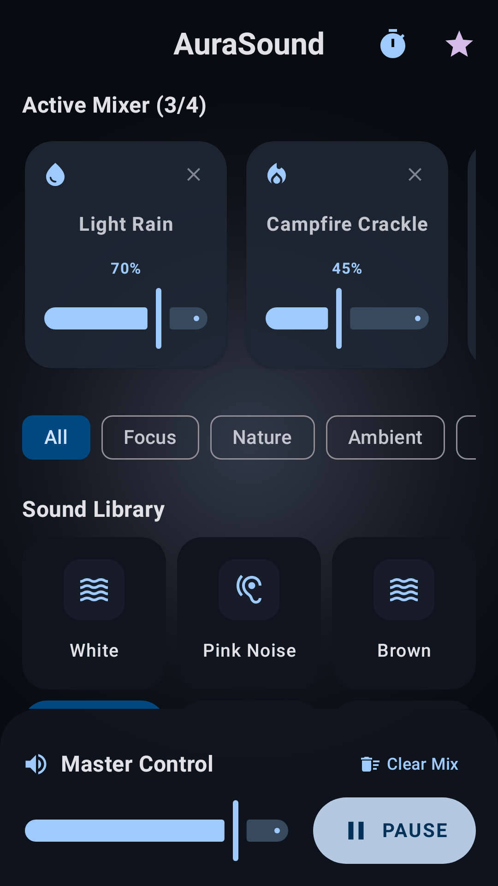
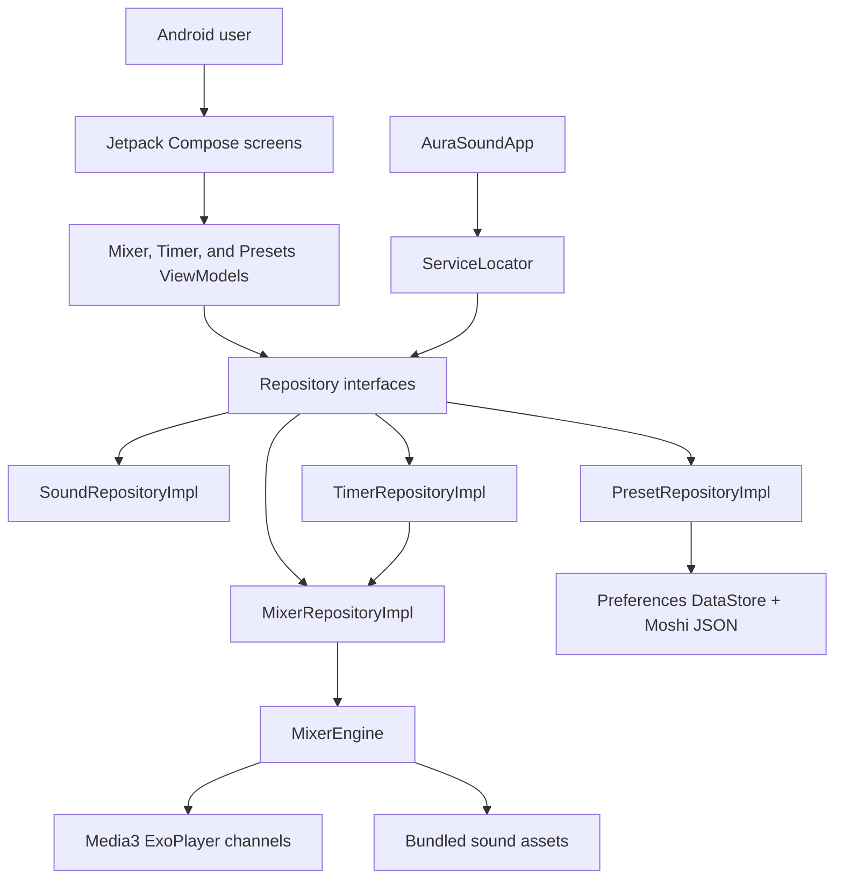

# AuraSound

[](app/build.gradle.kts)
[](#license)
[](https://github.com/michaelsam94/AuraSound/commits/main)
[](https://github.com/michaelsam94/AuraSound/issues)
[](app/src/main/AndroidManifest.xml)

AuraSound is an offline Android ambient sound mixer for sleep, focus, relaxation, and mindfulness.
It lets people layer calming sound loops, adjust each channel independently, save favorite mixes,
and use a sleep timer without streaming audio or requiring an account.



## Project Overview

AuraSound solves a simple problem: building a personal background soundscape should be fast,
private, and available without a network connection. The app is aimed at people who study, work,
meditate, relax, mask environmental noise, or fall asleep with layered ambient audio.

There is no hosted demo configured. Play Store-ready screenshots and listing copy are stored in
[`play-store/`](play-store/).

## Key Features

- 🎚️ Layer up to four ambient tracks with independent per-channel volume controls.
- 🌧️ Browse 18 bundled sounds across Focus, Nature, Ambient, and Sleep categories.
- 💾 Save named presets locally and reload favorite mixes from DataStore.
- ⏲️ Start a sleep timer with optional master-volume fade-out before playback pauses.
- 📱 Use a phone navigation flow or an adaptive tablet split-pane layout.
- 🔁 Loop local Ogg/Opus audio assets through AndroidX Media3 ExoPlayer.
- 🛍️ Generate Play Store screenshots, feature graphics, and app icons through Roborazzi tests.

## Architecture Overview



### Components And Layers

The app is organized around a lightweight MVVM flow. Compose screens in `feature/` render UI
state from ViewModels, ViewModels depend on repository interfaces in `core/data/repository/`,
and concrete repositories in `data/` own playback, catalog, timer, and preset persistence.

`ServiceLocator` initializes app-wide repository instances from `AuraSoundApp`. `MixerEngine`
keeps ExoPlayer instances on a dedicated `HandlerThread`, one player per active sound channel.
`PresetRepositoryImpl` stores preset metadata as Moshi JSON in Preferences DataStore.

### Request And Data Flow

A user action such as adding a track updates `MixerViewModel`, which calls `MixerRepository`.
The repository updates its `StateFlow` for the UI and forwards the audio command to `MixerEngine`.
Saved presets travel through `PresetsViewModel` into DataStore, while the timer updates playback
through the same mixer repository so volume fade-out and pause behavior remain centralized.

### Design Patterns

- MVVM with unidirectional UI state exposed as Kotlin `StateFlow`.
- Repository interfaces separating UI logic from playback and persistence details.
- Service locator dependency wiring instead of a DI framework.
- Adapter-style persistence entities for stable preset serialization.

## Tech Stack & Libraries

| Layer | Technology | Version | Purpose |
| --- | --- | --- | --- |
| Build system | Gradle Wrapper | 9.5.1 | Reproducible Android builds |
| Android plugin | Android Gradle Plugin | 9.1.1 | Android application packaging |
| Language | Kotlin | 2.2.10 | App implementation |
| Platform SDK | Android SDK | compile 36.1, min 24, target 36 | Android runtime compatibility |
| UI | Jetpack Compose BOM | 2024.09.00 | Declarative app UI |
| UI components | Material 3 | BOM-managed | App theme and controls |
| Navigation | AndroidX Navigation Compose | 2.8.9 | Phone screen navigation |
| Lifecycle | AndroidX Lifecycle ViewModel Compose | 2.8.7 | ViewModel integration |
| Audio | AndroidX Media3 ExoPlayer | 1.5.0 | Offline looping playback |
| Persistence | AndroidX DataStore Preferences | 1.1.7 | Local preset storage |
| Serialization | Moshi | 1.15.2 | Preset JSON adapters |
| Async | Kotlin Coroutines | 1.10.2 | Flows, timers, background work |
| Testing | JUnit | 4.13.2 | Local unit tests |
| Testing | Robolectric | 4.16.1 | JVM Android runtime tests |
| Screenshots | Roborazzi | 1.59.0 | Play Store image generation |
| Secrets | Maps Platform Secrets Gradle Plugin | 2.0.1 | Reads `.env` and `.env.example` |

## Prerequisites

- macOS, Linux, or Windows with Android Studio installed.
- JDK 17. The repo currently pins `org.gradle.java.home` to a Homebrew JDK 17 path in
  `gradle.properties`; update that path if your machine differs.
- Android SDK with API 36 / 36.1 platform support.
- Android emulator or physical device running Android 7.0 or newer.
- Python 3 and `ffmpeg` only if you regenerate Freesound audio assets.

| Variable | Required | Default | Description |
| --- | --- | --- | --- |
| `GEMINI_API_KEY` | No | `MY_GEMINI_API_KEY` in `.env.example` | Legacy AI Studio secret; not referenced by current Kotlin source. |
| `FREESOUND_TOKEN` | Only for `scripts/fetch_sounds.py` | Not configured | Freesound API token used to refresh CC0 audio files. |
| `KEYSTORE_PATH` | Only for release signing without `key.properties` | `${rootDir}/my-upload-key.jks` | Release keystore path fallback. |
| `STORE_PASSWORD` | Only for release signing without `key.properties` | Not configured | Release keystore password fallback. |
| `KEY_PASSWORD` | Only for release signing without `key.properties` | Not configured | Release key password fallback. |

## Installation & Setup

1. Clone the repository.

```bash
git clone https://github.com/michaelsam94/AuraSound.git
cd AuraSound
```

2. Confirm that JDK 17 is available and adjust `gradle.properties` if needed.

```bash
/usr/libexec/java_home -V
```

3. Copy the environment example if you want the Secrets Gradle Plugin to find a local `.env`.

```bash
cp .env.example .env
```

4. Sync the project in Android Studio or run a Gradle task from the terminal.

```bash
./gradlew :app:assembleDebug
```

5. Install the debug APK on a connected device or emulator.

```bash
./gradlew :app:installDebug
```

6. Database setup is not applicable. AuraSound uses Preferences DataStore and creates local
   preset storage automatically on device.

## Configuration

Most runtime behavior is configured directly in Kotlin and Gradle files:

| File | Purpose | Restart required |
| --- | --- | --- |
| `app/build.gradle.kts` | Application id, SDK versions, signing, tests, assets, dependencies | Rebuild app |
| `gradle/libs.versions.toml` | Central dependency and plugin versions | Gradle sync |
| `gradle.properties` | JVM, Gradle cache, JDK path, Kotlin compiler settings | Gradle daemon restart may be needed |
| `.env` | Optional local secret values read by the Secrets Gradle Plugin | Rebuild app |
| `app/src/main/assets/sounds/` | Bundled audio loops grouped by category | Rebuild app |
| `app/src/main/res/values/strings.xml` | App display name | Rebuild app |

Release signing can use `key.properties` when present. If `key.properties` is missing, the
release config falls back to `KEYSTORE_PATH`, `STORE_PASSWORD`, and `KEY_PASSWORD`.

## Usage / Quick Start

### Build And Run A Debug APK

```bash
./gradlew :app:assembleDebug
./gradlew :app:installDebug
```

Open AuraSound on the device, select sounds from the category tabs, adjust channel volumes, and
press play to start the current mix.

### Generate Play Store Assets

```bash
./gradlew generatePlayStoreAssets
```

Generated assets are written to `play-store/`, including phone screenshots, tablet screenshots,
the feature graphic, and the 512 px app icon.

### Refresh Freesound-Based Audio Assets

```bash
export FREESOUND_TOKEN
python3 scripts/fetch_sounds.py
```

This refreshes the non-noise nature, ambient, and sleep tracks, normalizes them with `ffmpeg`,
and updates `app/src/main/assets/sounds/CREDITS.txt`.

## API Reference

Not applicable. AuraSound is a local Android app and does not expose an HTTP API, CLI API, or
public SDK in this repository. Retrofit and OkHttp are present in the Gradle catalog, but the
current Kotlin source does not define network endpoints or API clients.

## Project Structure

```text
.
├── app/
│   ├── build.gradle.kts                  # Android app module configuration
│   └── src/
│       ├── main/
│       │   ├── AndroidManifest.xml        # App entry point and media playback service
│       │   ├── assets/sounds/             # Bundled offline Ogg audio loops
│       │   ├── java/com/michael/aurasound/
│       │   │   ├── core/                  # Models, repository interfaces, shared helpers
│       │   │   ├── data/                  # Audio, preset, timer repository implementations
│       │   │   ├── feature/               # Mixer, presets, and timer UI/ViewModels
│       │   │   └── ui/theme/              # Compose theme definitions
│       │   └── res/                       # App resources, icons, theme, backup rules
│       ├── test/                          # JVM unit, Robolectric, and Roborazzi tests
│       └── androidTest/                   # Instrumented Android tests
├── gradle/
│   ├── libs.versions.toml                 # Version catalog
│   └── wrapper/                           # Gradle wrapper files
├── play-store/                            # Generated store graphics and listing copy
├── scripts/
│   ├── fetch_sounds.py                    # Refresh CC0 Freesound assets
│   └── gen_launcher_icons.py              # Generate legacy launcher PNGs
├── build.gradle.kts                       # Top-level Gradle plugins
├── gradle.properties                      # Build JVM and Gradle settings
└── settings.gradle.kts                    # Gradle project/module settings
```

## Testing

Run local JVM, Robolectric, and non-screenshot tests:

```bash
./gradlew :app:testDebugUnitTest
```

Run instrumented tests on a connected Android device or emulator:

```bash
./gradlew :app:connectedDebugAndroidTest
```

Record Roborazzi screenshots directly:

```bash
./gradlew :app:recordRoborazziDebug
```

Generate the Play Store screenshot suite:

```bash
./gradlew generatePlayStoreAssets
```

Unit and Robolectric tests live in `app/src/test/java/`. Instrumented tests live in
`app/src/androidTest/java/`. Screenshot tests are marked with the
`PlayStoreScreenshotTests` category and are excluded from normal `testDebugUnitTest` runs unless
the screenshot property is enabled by Roborazzi or `generatePlayStoreAssets`.

Coverage reporting is not configured in this repository.

## Deployment

### Debug Builds

```bash
./gradlew :app:assembleDebug
```

The debug build uses the repository debug signing config from `debug.keystore`.

### Release APK

```bash
./gradlew :app:assembleRelease
```

### Release App Bundle

```bash
./gradlew :app:bundleRelease
```

Release signing uses `key.properties` when available and environment-variable fallbacks otherwise.
Docker and Docker Compose are not configured because this is a native Android app, not a server
deployment.

Health checks are not applicable. Validate releases by installing a signed build on a test device,
checking audio playback, preset persistence, timer fade-out, and Play Store asset generation.

## Contributing

1. Fork the repository and create a short feature branch, for example
   `feature/preset-sorting` or `fix/timer-volume-reset`.
2. Use Conventional Commits such as `feat: add preset sorting` or `fix: restore master volume`.
3. Keep Kotlin style consistent with the existing Compose and repository patterns.
4. Run the relevant Gradle tests before opening a pull request.
5. Include updated Play Store screenshots when UI changes affect listing assets.

PR checklist:

- The app builds with `./gradlew :app:assembleDebug`.
- Relevant tests pass with `./gradlew :app:testDebugUnitTest`.
- New user-facing behavior is represented in Compose UI and ViewModel state.
- Store assets are regenerated when screenshots, icons, or feature graphics change.
- No local keystore passwords or private release keys are introduced.

`./docs/CONTRIBUTING.md` is not configured. Add that file if the project needs a longer
contribution guide.

## Roadmap

- [ ] Replace starter sample tests with domain tests for mixer limits, timer fade-out, and presets.
- [ ] Add an in-app sound attribution screen sourced from `assets/sounds/CREDITS.txt`.
- [ ] Add import/export for saved presets.
- [ ] Add optional background playback controls for pause and stop actions.
- [ ] Configure automated release checks and coverage reporting.

## License

Not configured. No `LICENSE`, `COPYING`, or equivalent license file is present in the repository.

Copyright © 2026 Michael Sam.

## Acknowledgements & Credits

AuraSound uses AndroidX, Jetpack Compose, Media3 ExoPlayer, DataStore, Moshi, Kotlin Coroutines,
Robolectric, and Roborazzi. Nature, ambient, and sleep recordings are CC0/public-domain clips
from Freesound; see `app/src/main/assets/sounds/CREDITS.txt` for source details. Focus noise
tracks are procedurally generated by the Gradle build.
